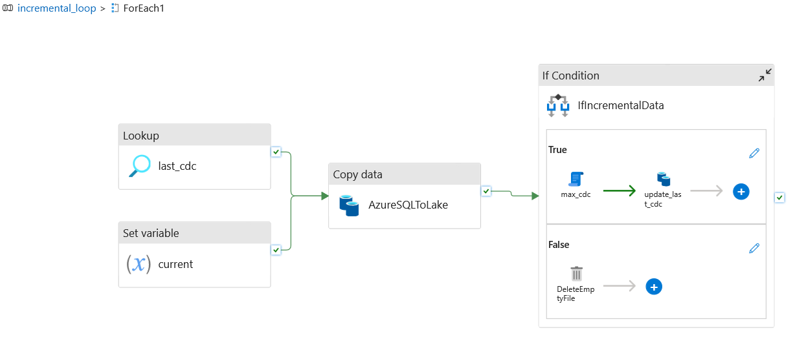
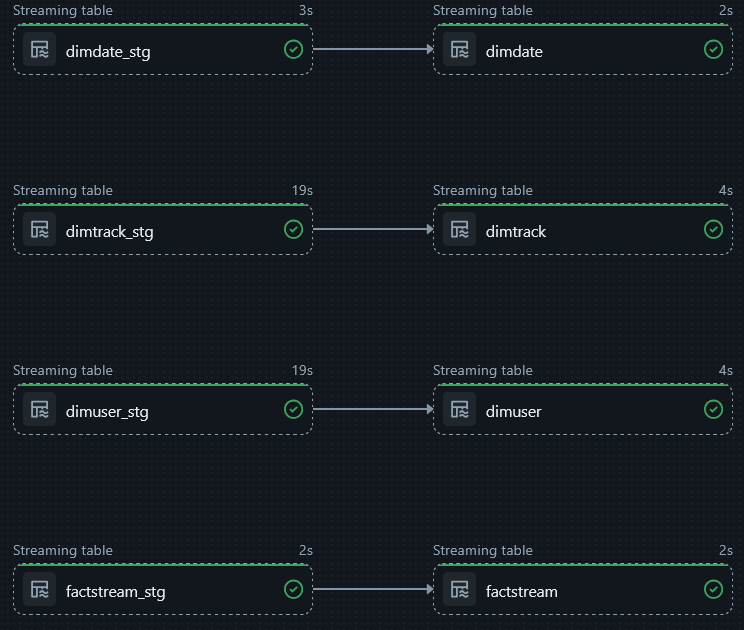
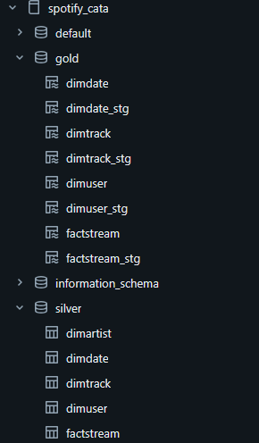
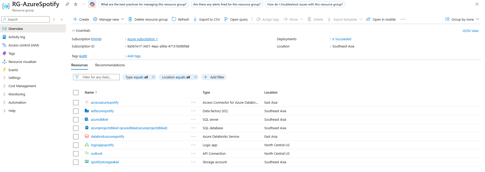

# Azure Spotify Data Engineering Project

An end-to-end data engineering pipeline that processes music streaming data using **Azure Data Factory**, **Databricks**, and **Delta Live Tables (DLT)**. Implements **Medallion Architecture (Bronze → Silver → Gold)** with dimensional modeling for analytics.

---

## Project Overview

This project demonstrates a production-grade data pipeline:
- **Source**: Azure SQL Database (music streaming data)
- **Ingestion**: Azure Data Factory (incremental loading)
- **Processing**: Azure Databricks (PySpark, Auto Loader)
- **Storage**: Azure Data Lake Gen2 + Unity Catalog
- **Governance**: Unity Catalog
- **Architecture**: Medallion (Bronze, Silver, Gold)
- **Modeling**: Dimensional (Star Schema)

---

## Architecture

### Data Flow
```
Azure SQL Database
    ↓
Azure Data Factory (Incremental Ingestion)
    ↓
Bronze Layer (ADLS Gen2 - Parquet)
    ↓
Databricks Auto Loader
    ↓
Silver Layer (Unity Catalog)
    ↓
Gold Layer (Delta Live Tables)
```

---

## Medallion Architecture

### Bronze Layer
- Raw data ingestion from Azure SQL Database
- Incremental loading via Azure Data Factory
- Stored in ADLS Gen2 as JSON/Parquet files
- Preserves original data structure

**Pipeline**: `incremental_loop` (ADF)  
**Output Formats**: `azure_sql.json`, `json_dynamic.json`, `parquet_dynamic.json`

### Silver Layer
- Data cleaning and standardization
- Schema enforcement and validation
- Derived field calculations
- Quality checks and deduplication
- Stored in Unity Catalog: `spotify_cata.silver`

**Tables**:
- `dimuser` - User dimension
- `dimdate` - Date dimension
- `dimtrack` - Track dimension
- `dimartist` - Artist dimension
- `factstream` - Streaming events

**Code**: `databricks/asset_bundle/src/silver/`

### Gold Layer (DLT)
- Analytics-ready dimensional model
- Star schema with 4 dimensions + 1 fact table
- Stored in Unity Catalog: `spotify_cata.gold`

**Pipeline**: `gold_pipeline` (Delta Live Tables)

**Code**: `databricks/asset_bundle/src/gold/dlt/transformations/`

---

## Delta Live Tables Pipeline

The DLT pipeline creates:
- Staging tables from Silver layer
- Final dimension and fact tables in Gold layer
- Built-in data quality validation
- Automatic dependency management

---

## Dimensional Model

The Gold layer follows a **star schema** design:

**Dimension Tables**:
- `dimuser` - User information and subscription details
- `dimdate` - Date attributes for time-based analysis
- `dimtrack` - Track metadata (title, artist, album)
- `dimartist` - Artist information

**Fact Table**:
- `factstream` - User streaming events with foreign keys to dimensions

This structure supports efficient BI queries and analytics.

---

## Project Structure
```
azure-spotify-project/
├── dataset/                    # Sample data files from ADF
│   ├── azure_sql.json         # SQL export format
│   ├── json_dynamic.json      # Dynamic JSON format
│   └── parquet_dynamic.json   # Dynamic Parquet format
├── factory/                    # Azure Data Factory pipelines
│   ├── pipeline/              # Incremental ingestion pipeline
│   ├── linkedService/         # Connection configurations
│   └── dataset/               # Dataset definitions
├── databricks/                # Databricks components
│   └── asset_bundle/          # Asset bundle (Bronze/Silver/Gold)
│       ├── src/
│       │   ├── gold/dlt/      # Delta Live Tables (Gold)
│       │   └── silver/        # Silver transformations
│       ├── resources/
│       └── databricks.yml
└── docs/                      # Documentation and diagrams
```

---

## Technologies Used

**Cloud Platform**:
- Azure Data Factory
- Azure Databricks
- Azure Data Lake Storage Gen2
- Azure SQL Database
- Unity Catalog

**Data Technologies**:
- Delta Lake
- Delta Live Tables
- Apache Spark / PySpark
- Auto Loader

**Tools**:
- Python
- SQL
- Databricks Asset Bundles
- Git

---

## Key Features

- **Incremental Loading**: Efficient watermark-based ingestion from SQL Database
- **Data Quality**: Built-in expectations in Delta Live Tables
- **Scalability**: Distributed processing with Spark
- **Governance**: Centralized with Unity Catalog
- **ACID Transactions**: Delta Lake guarantees
- **Infrastructure as Code**: Databricks Asset Bundles
- **Dimensional Modeling**: Star schema for analytics

---

## Skills Demonstrated

- Azure Data Factory & Orchestration
- Azure SQL Database integration
- Azure Databricks & PySpark
- Delta Lake & Delta Live Tables
- Medallion Architecture
- Data Quality enforcement
- Dimensional Modeling (Star Schema)
- Unity Catalog & Data Governance
- Infrastructure as Code
- End-to-End Data Pipelines
- Cloud Data Engineering

---

## Screenshots

### Azure Data Factory Pipeline


### Delta Live Tables Pipeline


### Unity Catalog Structure


### Azure Resources


---

## Notes

- This project is a guided learning exercise to demonstrate data engineering skills
- Dataset is sample music streaming data stored in Azure SQL Database
- Implements production-ready patterns and best practices
- Project structure and architecture can be adapted for real-world use cases

---

## Author

**Kiel Talampas**
- GitHub: [@kieltalampas](https://github.com/kieltalampas)


